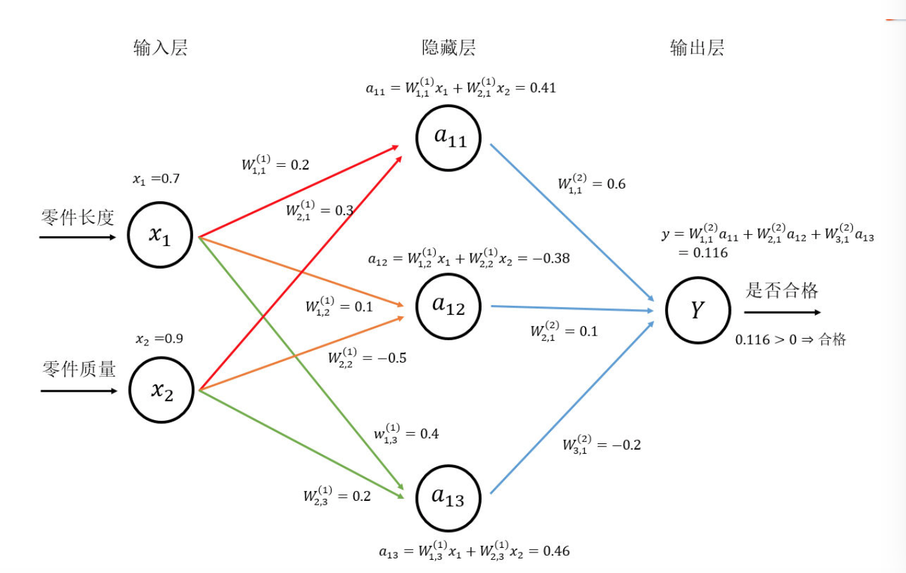

#TensorFlow环境搭建
##主要依赖的包
###Protocol Buffer
处理结构化数据的工具

结构化数据：

```
name: 张三
id:12345
email:zhangsan@abc.com
```

将结构化数据序列化，即将结构化数据编程数据流的格式，即变为一个字符串。

Protocal Buffer主要解决的问题：

* 将结构化数据序列化
* 从序列化数据流中还原出原来的结构化数据

Protocal Buffer格式数据与XML、JSON的最大区别：

* 序列化后得到的数据是二进制流而不是字符串。
*  需要先定义数据的格式schema，在还原一个序列化之后的数据时需要使用这个定义好的数据格式。

例如：

```
message user{
	optional string name = 1;
	required int32 id=2;
	repeated string email=3;
}
```

这样的message一般保存在.proto文件中，每一个message代表一类结构化数据

---

###Bazel
谷歌开源的自动化构建工具

项目空间（workspace）

* 一个文件夹
	* 包含编译软件所需的源代码以及输出结果的软连接地址
	* 一个项目空间可以包含
		* 一个应用
		* 多个应用
* 通过BUILD文件来找到需要编译的目标
* Bazel的编译方式是事先定义好的
	* 对Python支持的编译方式
		* py_binary
			* 将python程序编译为可执行文件
		* py_library
			* 编译Python测试程序将python程序编译成库函数供其他py_binary或py\_test调用
		* py_test
			* 编译Python测试程序

##TensorFlow安装
###使用Virtualenv安装
首先安装pip和Virtualenv

```
sudo easy_install pip
pip install --upgrade virtualenv
```
通过以下指令创建Virtualenv环境

```
	virtualenv --system-site-packages -p python3 targetDirectory # for Python 3.n
```
...未完，因为不知道我的电脑是否可以直接跑gpu，因此暂时使用已有的cpu版本
###使用pip安装
#TensorFlow工作原理
##TensorFlow计算模型:计算图
###计算图的概念
Tensor：张量

* 张量可以理解为多维数组
* 表明了它的数据结构

Flow：流

* 直观地表达了张量之间通过计算相互转化的过程
* 体现了它的计算模型

TensorFlow

* 通过计算图的形式来表述计算的编程系统
	* 常量是计算图的初始点
	* 每一个计算都是计算图上的一个节点
	* 节点之间的边描述了计算之间的依赖关系

###计算图的使用
第一个阶段需要定义计算图中的所有计算，然后第二个阶段为执行计算

计算定义阶段：

```
import tensorflow as tf
a=tf.constant([1.0,2.0],name="a")
b=tf.constant([2.0,3.0],name="b")
result=a+b
```
这一过程中，TensorFlow自动将定义的计算转化为计算图上的节点，查看运算所属计算图可以这样：

```
#通过a.graph可以查看张量所属的计算图，因为没有特意指定，这个计算图属于当前默认的计算图，所以下面这个操作输出值为true
print(a.graph is tf.get_default_graph())
```
除了使用默认计算图，TensorFlow可以使用tf.Graph生成新的计算图，不同计算图上的张量和运算都不会共享

在不同计算图中定义和使用变量如下所示：

```
import tensorflow as tf
g1=tf.Graph()
with g1.as_default():
	#在计算图g1中定义变量v，并设置初始值为0
	v=tf.get_variable(
	"v",initializer=tf.zeros_initializer()(shape=[1]))
	
g2=tf.Graph()
with g2.as_default():
	#在计算图g2中定义变量v，并设置初始值为1
	v=tf.get_variable(
	"v",initializer=tf.ones_initializer()(shape=[1]))

#在计算图g1中读取变量v的值
with tf.Session(graph=g1) as sess:
	tf.initialize_all_variables().run()
	with tf.variable_scope("",reuse=True):
		#在计算图g1中，变量v的取值应该为0，所以下行输出[0.]
		print(sess.run(tf.get_variable("v")))
		
#在计算图g1中读取变量v的值
with tf.Session(graph=g2) as sess:
	tf.initialize_all_variables().run()
	with tf.variable_scope("",reuse=True):
		#在计算图g2中，变量v的取值应该为1，所以下行输出[1.]
		print(sess.run(tf.get_variable("v")))
```

由此可见TensorFlow计算图可以隔离张量和计算，不仅如此，计算图可以通过tf.Graph.device函数来指定运行计算的设备，例如使用加法计算在GPU上跑

```
g=tf.Graph()
#指定运行计算的设备
with g.device('/gpu:0'):
	resul=a+b
```

有效整理TensorFlow中的资源是计算图的一个重要功能

* 通过集合（collection）来管理不同类别的资源，例如：
	* 通过ft.add\_to_collection函数将资源加入一个或多个集合
	* 通过tf.get_collection获取一个集合里的所有资源
	
	
##TensorFlow数据模型：张量
###张量的概念
从功能角度：

* 张量是多维数组
	* 零阶张量为标量（scalar），即一个数
	* 第1阶张量为向量（vector），即一个一维数组
	* 第n阶张量是一个n为数组
* 在张量中没有保存数字，而是保存如何得到这些数字的计算过程，例如下代码，得到的不是加法结果，而是对结果的一个引用。

```
import tensorflow as tf
#tf.constant是一个计算，这个计算的结果为一个张量，保存在变量a中
a=tf.constant([1.0,2.0],name="a")
b=tf.constant([2.0,3.0],name="b")
result=tf.add(a,b,name="add")
print(result)
'''
输出：
Tensor("add:0", shape=(2,), dtype=float32)
'''
```
张量的各个成员有：

* 名字(name)
	* 是一个张量的唯一标识符，同时给出这个张量的计算方法
	* add:0 是指result张量是计算节点add输出的第一个结果（编号从0开始）
* shape
	* 描述张量的维度信息
	* shape=(2,)表示张量result是一个一维数组，数组的长度为2
* type
	* 每一个张量会有一个唯一的类型，如果参加运算的张量类型不匹配则会报错。
	* TensorFlow支持14种不同的类型，主要包括
		* 实数
			* tf.float32
			* tf.float64
		* 整数
			* tf.int8
			* tf.int16
			* tf.int32
			* tf.int64
			* tf.uint9
		* 布尔型：tf.bool
		* 复数：tf.complex64、tf.complex128

张量的使用

* 第一类：对中间计算结果的引用
* 第二类：计算图构造完成之后，用于获得计算结果，通过会话（session）获取真实数字

##TensorFlow运行模型：会话
会话拥有并管理TensorFlow程序运行时的所有资源，当所有计算完成之后需要关闭会话来回收资源

会话的模式：

* 需要明确调用会话生成函数和关闭会话函数

```
#创建一个会话
sess=tf.Session()
#使用这个创建好的会话来获得计算结果，例如，sess.run(result)
sess.run(result)
#关闭会话使得这次运行中使用到的资源得到释放
sess.close()
```
* 使用python的上下文管理器来使用会话，这样可以防止异常退出时资源释放的问题

```
#创建一个会话，并通过python上下文管理器来管理这个会话
with tf.Session() as sess:
	#使用这个创建好的会话来计算结果
	sess.run(result)

#不需要再调用Session.close()来关闭会话
#当上下文退出时会话关闭，资源释放自动完成
```
默认会话：

* 设定默认会话计算张量取值

```
sess=tf.Session()
with sess.as_default():
	print(result.eval())
```

这种方式与下面相同

```
sess=tf.Session()
print(sess.run(result))
print(result.eval(session=sess))
#上面两个指令效果一样
sess.close()
```
在交互式环境下（比如Python脚本），设置默认会话方式来获取张量取值更加方便

* 在交互式环境下直接构建默认会话函数:tf.InteractiveSession()

```
sess=tf.interactiveSession()
print(result.eval())
sess.close()
```

tf.InteractiveSession函数可以省去把产生的会话注册为默认会话的过程

无论哪种方法都可以通过ConfigProto Protocol Buffer来配置需要生成的会话

```
config=tf.ConfigProto(allow_soft_placement=True,
		log_device_placement=True)
sess1=tf.InteractiveSession(config=config)  #默认对话
sess2=tf.Session(config=config)  #新的对话
						
```
ConfigProto可以配置：

* 类似并行的线程数
* GPU分配策略
* 运算超时时间

---

常用的两个参数：

* allow\_soft_placement
	* 布尔型参数，为True的时候，以下任一条件成立，GPU运算可以放到CPU上进行
		* 运算无法再GPU上执行
		* 没有GPU资源
			* 例如运算被指定在第二个GPU上运行，但机器只有1个GPU
		* 运算输入包含对CPU计算结果的引用
	* 默认值为False
* log\_device_placement
	* 布尔型参数，为True时，日志中会记录每个节点被安排在哪个设备上以方便调试
	* 在生产环境中将这个参数设置为False可以减少日志量

##TensorFlow实现神经网络
###原理
对实际问题处理

* 提取特征向量，例如零件的长度和质量两个数字的组合
* 将特征向量输入神经网络
	* 主流神经网络都是分层的结构
		* 第一层是输入层
			* 代表特征向量中每一个特征的取值
			* 同一层的节点不会相互连接
		* 每一层与下一层连接
		* 最后一层为输出层
			* 得到计算结果
				* 例如零件是否合格，输出层只包含一个节点，输出实数值
					* 通过这个输出值和事先设定的阈值就可以得到最后的分类结果。
						* 一般来说，当输出值离阈值越远时得到的答案越可靠。
		* 输入层与输出层之间的神经网络叫做隐含层
			* 隐含层越多，神经网络越深
* 通过训练数据来调整神经网络中参数的取值
* 使用训练好的神经网络预测未知的参数

##前向传播算法
以最简单的全连接网络结构前向传播算法为例

---

###了解神经元（节点）的结构

* 神经元是构成一个神经网络的最小单元
* 具有多个输入和一个输出
	* 输入可以是
		* 其他神经元的输出
		* 或者是整个神经网络的输入
	* 输出
		* 最简单的是所有输入的加权和
			* 不同输入的权重就是神经元的参数
			* 神经网络的优化过程是优化神经元中的参数取值过程（优化权重？）

---

###神经网络的向前传播过程

神经网络向前传播需要

* 神经网络的输入
	* 实体中提取的特征向量
* 神经网络的连接结构
	* 由神经元（节点）构成
	* 指的是不同神经元之间的输入输出连接关系
* 每个神经元中的参数
	* 用w表示
		* w的上标为神经网络层数
		* w的下标为连接节点编号，例如w1,2表示连接x1和a12节点的边上的权重

通过给定神经网络的输入、神经网络的结构以及边上的权重，即可通过前向传播算法来计算出神经网络的输出

下图为神经网络前向传播算法示意图


在TensorFlow中实现神经网络的前向传播过程：

```
a=tf.matmul(x,w1)
y=tf.matmul(a,w2)
```

### 用TensorFlow去保存和使用神经网络的参数
tf.Variable的作用就是保存和更新神经网络中的参数
### 神经网络代码实例
```
import os
os.environ['TF_CPP_MIN_LOG_LEVEL'] = '2'  # or any {'0', '1', '3'}

import tensorflow as tf

#声明w1、w2两个变量，通过seed参数设定随机种子
#保证每次运行的结果一样
w1=tf.Variable(tf.random.normal([2,3],stddev=1,seed=1))
w2=tf.Variable(tf.random.normal([3,1],stddev=1,seed=1))
# 暂时将输入的特征向量定位一个常量，注意，这里x是一个1*2的矩阵
x=tf.constant([[0.7,0.9]])

#通过前向传播算法获得神经网络的输出
a=tf.matmul(x,w1)
y=tf.matmul(a,w2)

#新建一个对话
sess=tf.compat.v1.Session()
#首先要运行初始化变量w1,w2
#sess.run(w1.initializer)
#sess.run(w2.initializer)
#或者直接初始化所有变量
init_op=tf.compat.v1.global_variables_initializer()
sess.run(init_op)
#再运行y
print(sess.run(y))
```
### 通过TensorFlow训练神经网络模型
使用监督学习的方式更合理设置参数的取值，同时给出TensorFlow程序来完成这个过程。

设置神经网络参数的过程就是神经网络的训练过程。

监督学习

* 重要思想
	* 在已知答案的标注数据集上，模型给出的预测结果要尽量接近真实的答案。通过调整神经网络中的参数对训练数据进行拟合，使得模型对未知的样本提供预测的能力。

神经网络优化算法中最常用的方法：反向传播算法（backpropagation）

反向传播算法的过程：

* 迭代的开始，选取一小部分训练数据（batch）
* 通过前向传播算法得到神经网络模型的预测结果
* 对比预测答案与正确答案间的差距
* 基于预测的差距，反向传播算法更新神经网络的参数取值

对比过程的TensorFlow代码实现

* 迭代的开始，选取一小部分训练数据（batch）
	* placeholder机制用于提供输入数据
		* placeholder相当于定义了一个位置，位置中的数据在程序运行时再指定
		* 这样程序中不需要生成大量的常量来提供输入数据
			* 将数据通过placeholder传入TensorFlow计算图
	* placeholder的定义
		* 该位置的数据类型是指定的，且不可改变
		* 维度信息可以根据提供的数据推导得出，不需要一定给出

```
import tensorflow as tf

w1=tf.Variable(tf.random_)
```
* 通过前向传播算法得到神经网络模型的预测结果
* 对比预测答案与正确答案间的差距
* 基于预测的差距，反向传播算法更新神经网络的参数取值